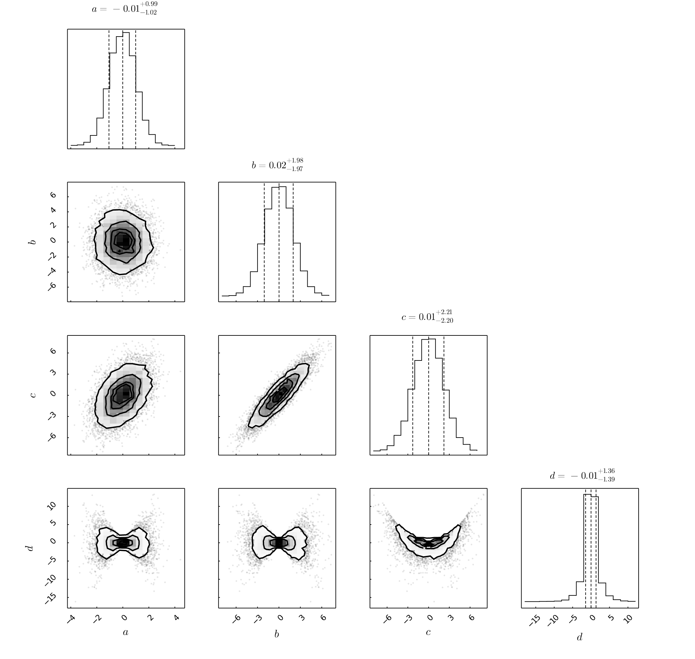
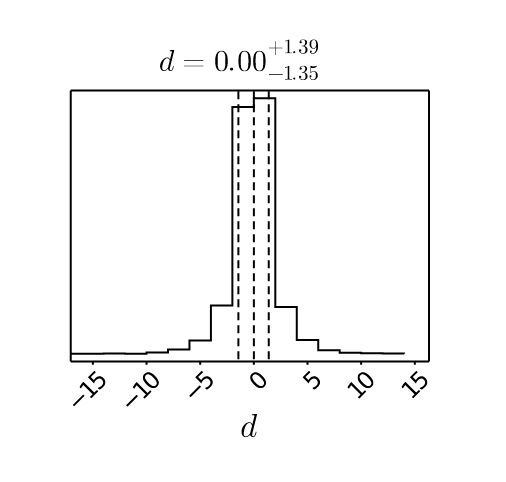
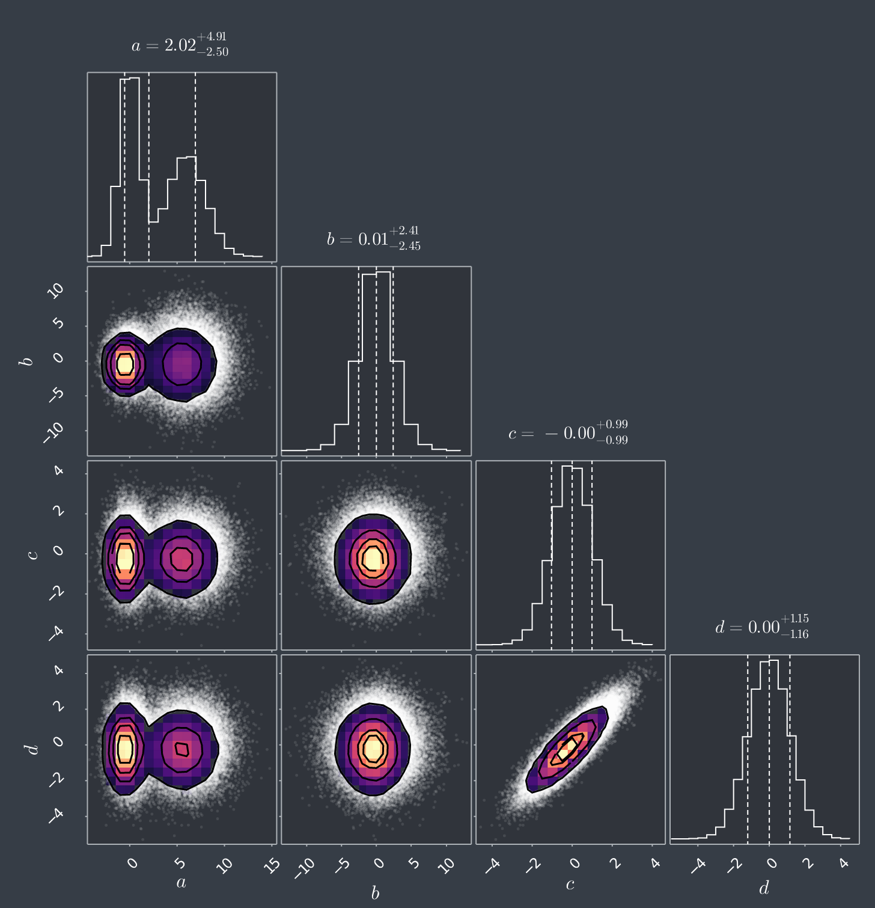
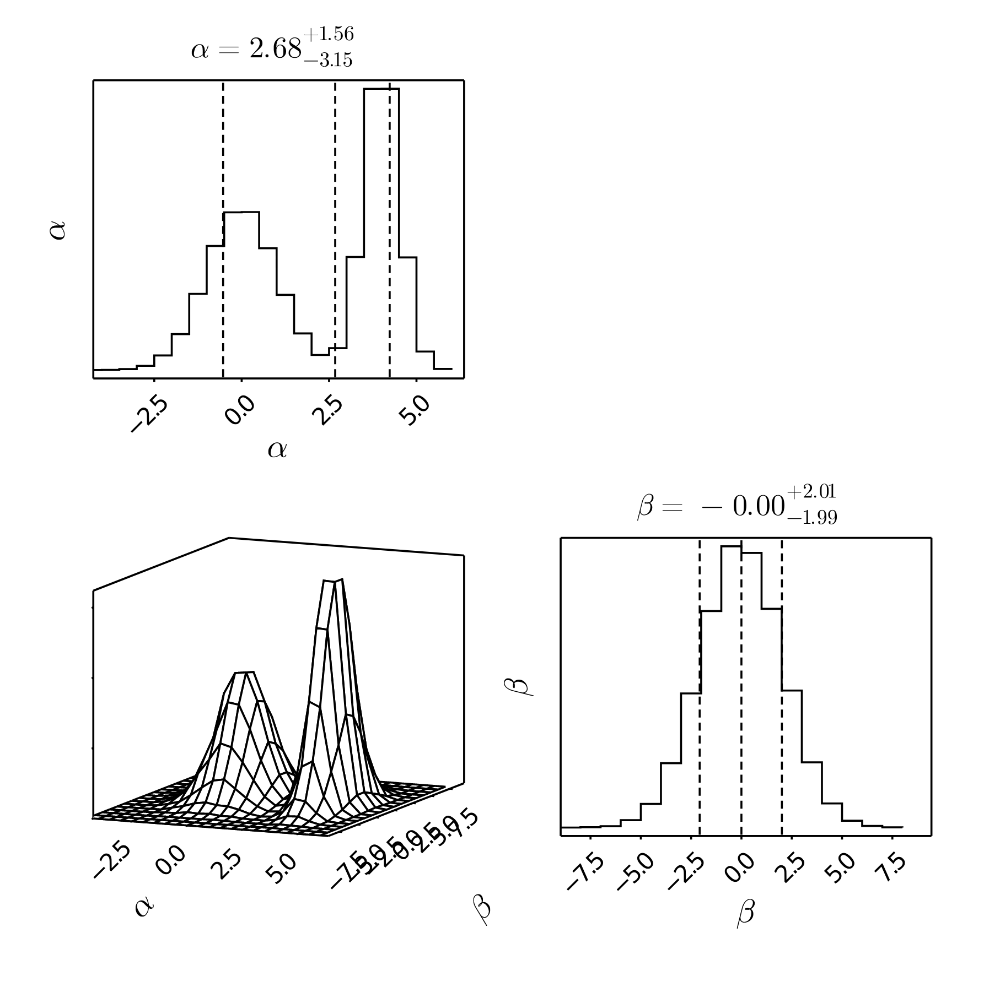
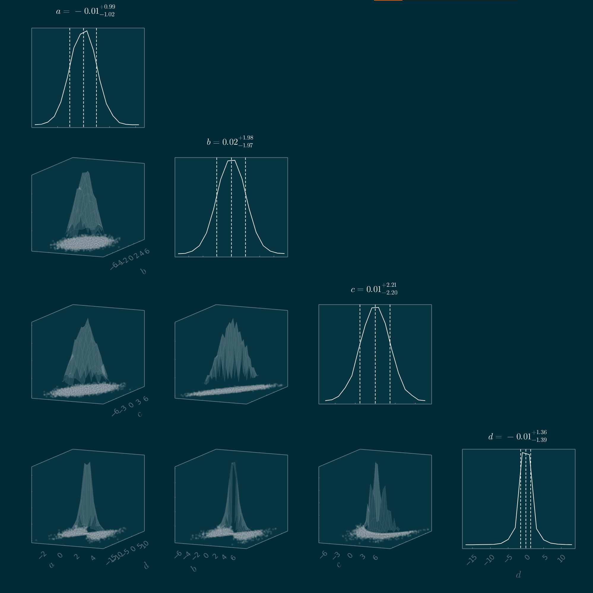

# CornerPlots.jl

This package produces corner plots, a grid of 1D and 2D histograms that allow you to visualize high dimensional data.

The defaults in this package aim to reproduce the output of the well-known Python library [corner.py](https://corner.readthedocs.io/en/latest/index.html) as closely as possible. If these are not to your tastes, this package is highly configurable (see examples below).

See also: [StatsPlots.cornerplot](https://github.com/JuliaPlots/StatsPlots.jl#corrplot-and-cornerplot), [GeoStats.cornerplot](https://juliaearth.github.io/GeoStats.jl/stable/plotting.html#cornerplot), and [CornerPlot.jl](https://github.com/kilianbreathnach/CornerPlot.jl) for Gadfly.

This package is curently experimental and under active development. 

## Notes
This pacakge is currently only tested using the GR plots backend, and furthermore, saving plots as PNG or PDF often produces artifacts.
I recommend you save your figures as SVG.

The edges of the outer contour are currently jagged compared to `corner.py`. I am still investigating how this can be improved.

If `plotscatter` is true (default), the performance of Plots can suffer with very large datasets. In those cases, I recommend you either thin the data or disable that option to only show histograms and contours.

There is somewhat excessive space between the individual subplots compared to `corner.py` that cannot easily be removed. I am investigating manual layouts using `inset_subplots` to fix this.

## Usage
```julia
corner(table [, labels])
```
This function has one required argument, a [Tables.jl](https://tables.juliadata.org/stable/) compatible table consisting of one or more columns. This can simply be a named tuple of vectors, a [DataFrame](https://dataframes.juliadata.org/stable/), [TypedTable](https://typedtables.juliadata.org/stable/), result of an execute statement from [SQLLite](https://juliadatabases.org/SQLite.jl/stable/), data loaded from [Arrow](https://arrow.juliadata.org/stable/manual/#Writing-arrow-data), etc.

The variable names are by default taken from the column names of the input table, but can also be supplied by a second vector of strings.

This package uses [RecipesBase](http://juliaplots.org/RecipesBase.jl/stable/) rather than [Plots](http://docs.juliaplots.org/latest/) directly, so you must also load Plots in order to see any output. The package is only tested with [GR](https://github.com/jheinen/GR.jl).

### Examples

Basics:
```julia
using Plots, CornerPlots
gr()

# Generate some data to visualize
a = randn(10000)
b = 2randn(10000)
c = a .+ b
d = a .* b

table = (;a,b,c,d)

corner(table)
```


Single variable:
```julia
corner((;d))
```


Appearance:
```julia
theme(:dark) # See PlotThemes.jl included with Plots.
corner(
    table,
    hist2d_kwargs=(;color=:magma),
    hist_kwargs=(;color=:white,titlefontcolor=:white),
    scatter_kwargs=(;color=:white);
    percentiles_kwargs=(;color=:white),
)
```



3D wireframe and line plots:
```julia
corner(table, hist2d_kwargs=(;seriestype=:wireframe, nbins=15), plotscatter=false, dpi=200)
```


```julia
theme(:solarized);
corner(
    table,
    hist2d_kwargs=(;color=:magma,seriestype=:wireframe),
    hist_kwargs=(;color=:white,titlefontcolor=:white,seriestype=:line),
    scatter_kwargs=(;color=:white);
    percentiles_kwargs=(;color=:white),
)
```



### Full API
```julia
corner(table [, labels]; plotcontours, plotscatter, plotpercentiles, hist_kwargs, hist2d_kwargs, contour_kwargs, scatter_kwargs, percentiles_kwargs, appearance)
```
The `corner` function also accepts the following keyword arguments:
* `plotcontours=true`: Overplot contours on each 2D histogram
* `plotscatter=true`: Plot individual data points under the histogram to reveal outliers. Disable to improve performance on large datasets.
* `plotpercentiles=[15,50,84]`: What percentiles should be used for the vertical lines in the 1D histogram. Pass an empty vector to hide.
* `hist_kwargs=(;)`: plot keywords for the 1D histograms.
* `hist2d_kwargs=(;)`: plot keywords for the 2D histograms.
* `contour_kwargs=(;)`: plot keywords for the contours plotted over the 2D histograms.
* `scatter_kwargs=(;)`: plot keywords for the data points scattered under the 2D histograms. 
* `percentiles_kwargs=(;)`: plot keywords for the vertical percentile lines on the 1D histograms. 
* `appearance=(;)`: General keywords for all subplots.

Remaining keyword arguments are forwarded to the main plot that holds the all of the subplots. For example, passing `size=(1000,1000)` sets the size of the overall figure not each individual subplot.

## Credits
This package is built on top of the great packages Plots, GR, RecipesBase, NamedTupleTools, and Tables. The overall inspiration and a few peices of code are taken directly from corner.py, whose authors IMO should be cited if you use this pacakge.

## TODO:
- Direct support for MCMCChains
- Supertitle support using a hidden extra plot
- Smooth edges of the outer contour
- Denser plot grid
