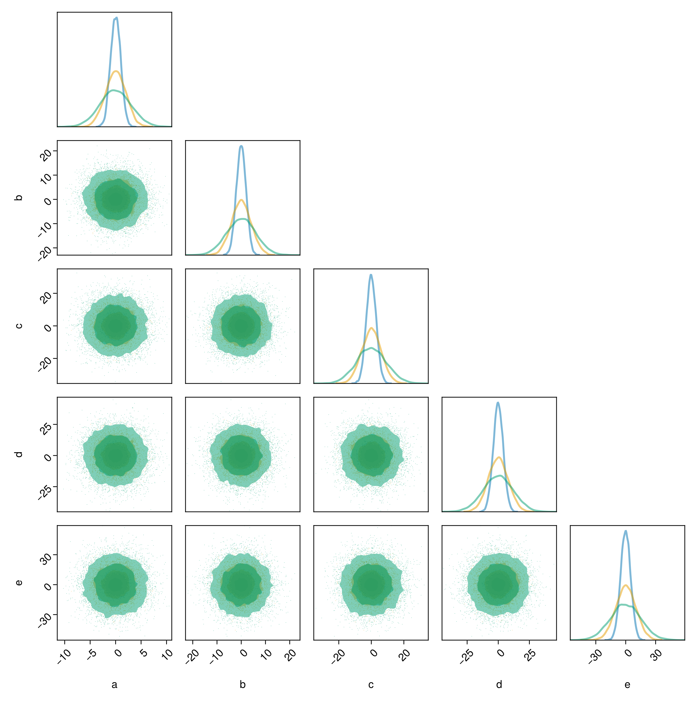
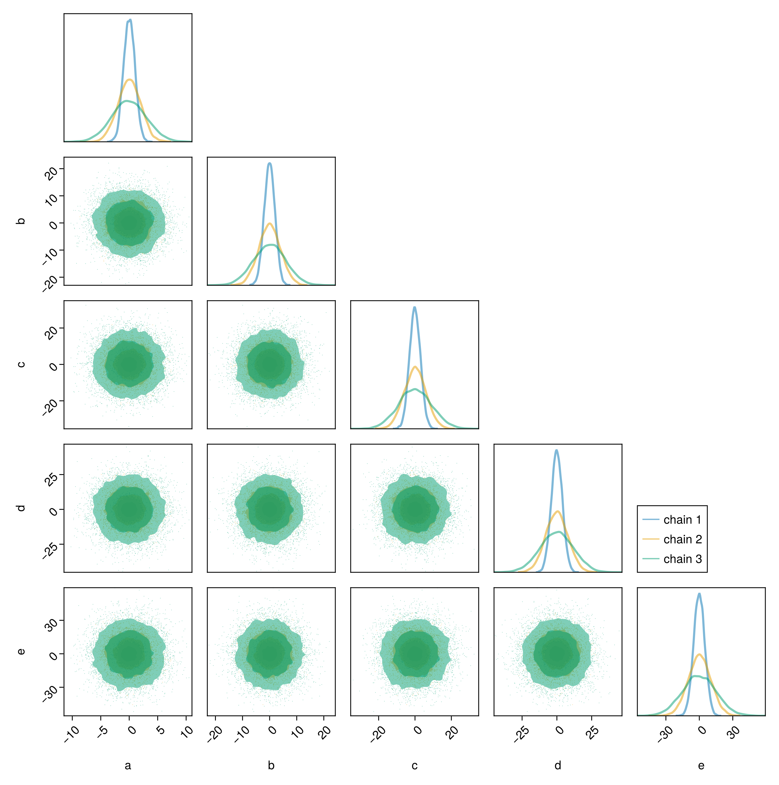
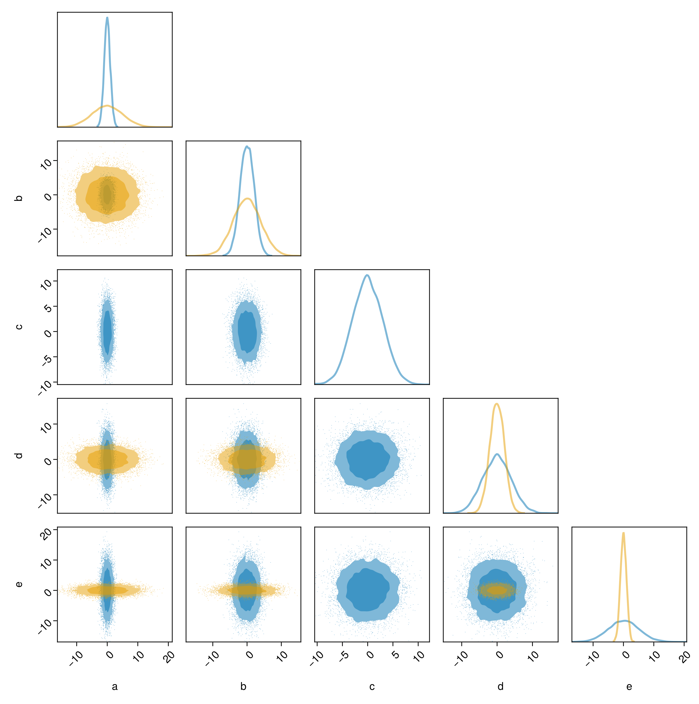

# Integration with MCMCChains.jl {#Integration-with-MCMCChains.jl}

MCMC packages like Turing often produce results in the form of an MCMCChains.Chain. There is special support in PairPlots.jl for plotting these chains.

::: tip Note

The integration between PairPlots and MCMCChains only works on Julia 1.9 and above. On previous versions, you can work around this by running `pairplot(DataFrame(chn))`.

:::

## Plotting chains {#Plotting-chains}

For this example, we'll use the following code to generate a `Chain`. In a real code, you would likey receive a chain as a result of sampling from a model.

```julia
chn1 = Chains(randn(10000, 5, 3) .* [1 2 3 4 5] .* [1;;;2;;;3], [:a, :b, :c, :d, :e])
```


```
Chains MCMC chain (10000×5×3 Array{Float64, 3}):

Iterations        = 1:1:10000
Number of chains  = 3
Samples per chain = 10000
parameters        = a, b, c, d, e

Summary Statistics
  parameters      mean       std      mcse     ess_bulk    ess_tail      rhat  ⋯
      Symbol   Float64   Float64   Float64      Float64     Float64   Float64  ⋯

           a    0.0017    2.1640    0.0126   29708.9970   1149.2251    1.1299  ⋯
           b   -0.0027    4.3195    0.0248   30326.0391   1324.0127    1.1263  ⋯
           c    0.0592    6.5237    0.0378   29828.3374   1143.9731    1.1280  ⋯
           d   -0.0679    8.5981    0.0504   29219.1412   1300.2899    1.1280  ⋯
           e   -0.0214   10.8838    0.0629   29904.7856   1156.9533    1.1297  ⋯
                                                                1 column omitted

Quantiles
  parameters       2.5%     25.0%     50.0%     75.0%     97.5%
      Symbol    Float64   Float64   Float64   Float64   Float64

           a    -4.5595   -1.1719    0.0053    1.1689    4.6144
           b    -9.1149   -2.3321    0.0052    2.3234    9.0853
           c   -13.6775   -3.5261    0.0040    3.5667   14.0186
           d   -18.3489   -4.7443   -0.0435    4.5445   18.0043
           e   -23.0459   -5.8666   -0.0280    5.9001   22.9226

```


You can plot the results from all chains in the Chains object:

```julia
using CairoMakie, PairPlots

pairplot(chn1)
```


The labels are taken from the column names of the chains. You can modify them by passing in a dictionary mapping column names to strings, LaTeX strings, or Makie rich text objects.

## Plotting individual chains separately {#Plotting-individual-chains-separately}

If you have multiple parallel chains and want to plot them in different colors, you can pass each one to `pairplot`:

```julia
pairplot(chn1[:,:,1], chn1[:,:,2], chn1[:,:,3])
```



You can title the series indepdendently as well:

```julia
c1 = Makie.wong_colors(0.5)[1]
c2 = Makie.wong_colors(0.5)[2]
c3 = Makie.wong_colors(0.5)[3]

pairplot(
    PairPlots.Series(chn1[:,:,1], label="chain 1", color=c1, strokecolor=c1),
    PairPlots.Series(chn1[:,:,2], label="chain 2", color=c2, strokecolor=c2),
    PairPlots.Series(chn1[:,:,3], label="chain 3", color=c3, strokecolor=c3),
)
```



If your chains are well converged, then the different series should look the same.

## Comparing the results of two simulations {#Comparing-the-results-of-two-simulations}

You may want to compare the results of two simulations. Consider the following chains:

```julia
chn2 = Chains(randn(10000, 5, 1) .* [1 2 3 4 5], [:a, :b, :c, :d, :e])
chn3 = Chains(randn(10000, 4, 1) .* [5 4 2 1], [:a, :b, :d, :e]);
```


```
Chains MCMC chain (10000×4×1 Array{Float64, 3}):

Iterations        = 1:1:10000
Number of chains  = 1
Samples per chain = 10000
parameters        = a, b, d, e

Summary Statistics
  parameters      mean       std      mcse     ess_bulk    ess_tail      rhat  ⋯
      Symbol   Float64   Float64   Float64      Float64     Float64   Float64  ⋯

           a   -0.0073    4.9842    0.0502    9838.5102   9334.6534    1.0001  ⋯
           b   -0.0164    4.0394    0.0408    9779.8037   9803.4574    1.0001  ⋯
           d   -0.0051    2.0257    0.0202   10021.1884   9841.8729    1.0000  ⋯
           e    0.0049    1.0039    0.0101    9944.4387   9920.3716    1.0000  ⋯
                                                                1 column omitted

Quantiles
  parameters      2.5%     25.0%     50.0%     75.0%     97.5%
      Symbol   Float64   Float64   Float64   Float64   Float64

           a   -9.7229   -3.3717   -0.0174    3.3897    9.7504
           b   -7.8223   -2.7375   -0.0407    2.7084    7.9634
           d   -4.0172   -1.3543    0.0010    1.3916    3.8861
           e   -1.9595   -0.6773    0.0053    0.6887    1.9789

```


Just pass them all to `pairplot`:

```julia
pairplot(chn2, chn3)
```



Note how the parameters of the chains do not have to match exactly. Here, `chn2` has an additional variable not present in `chn3`.
