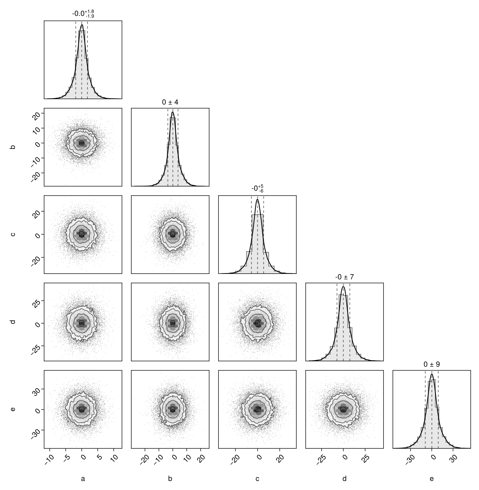
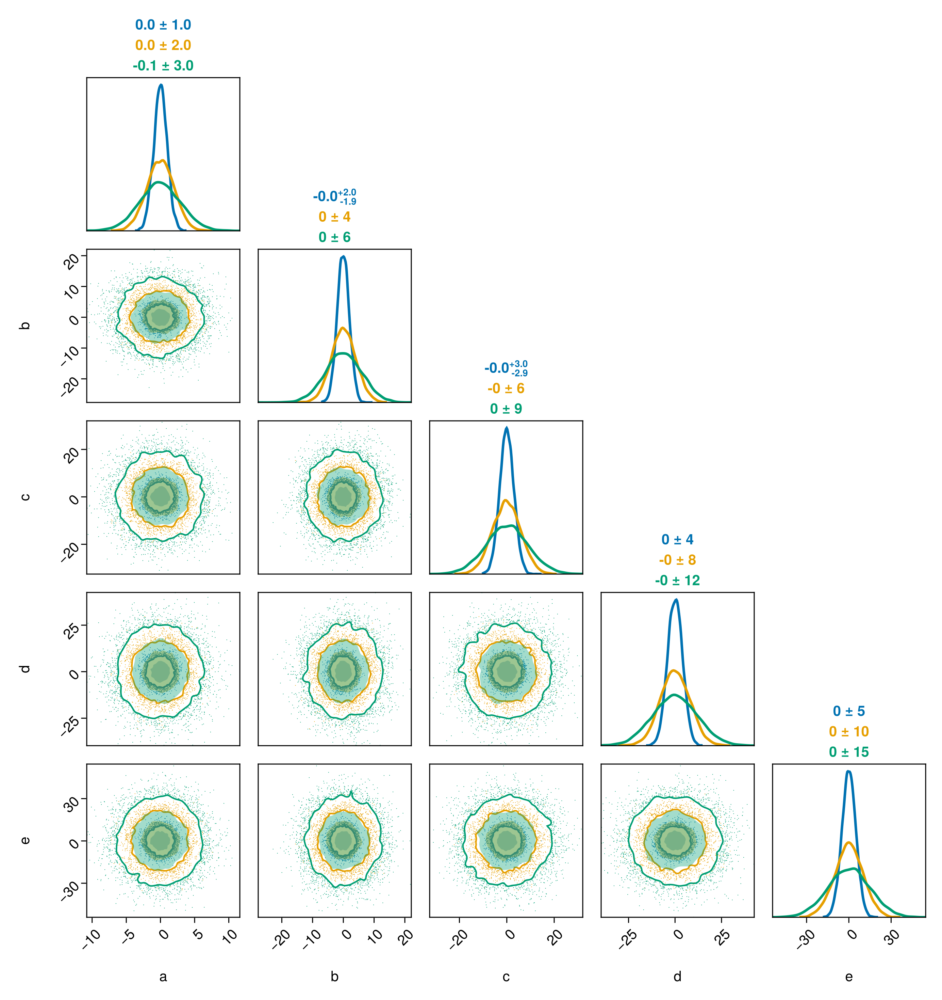
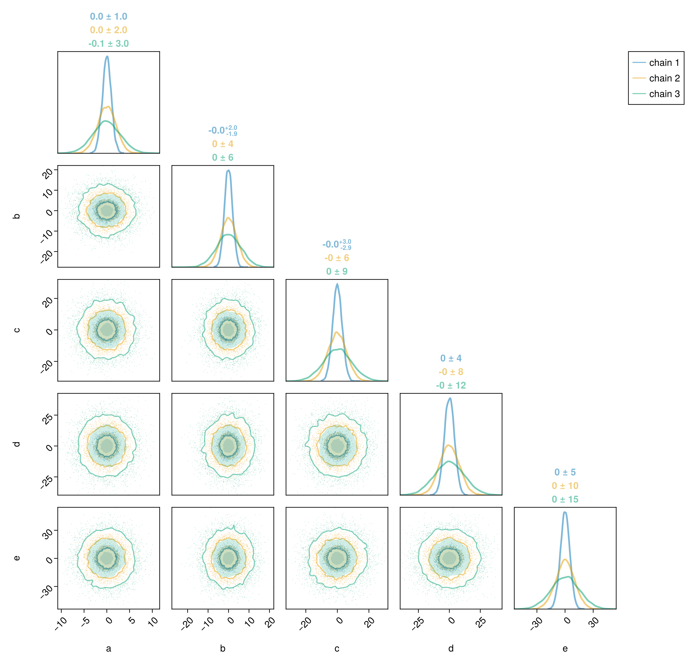
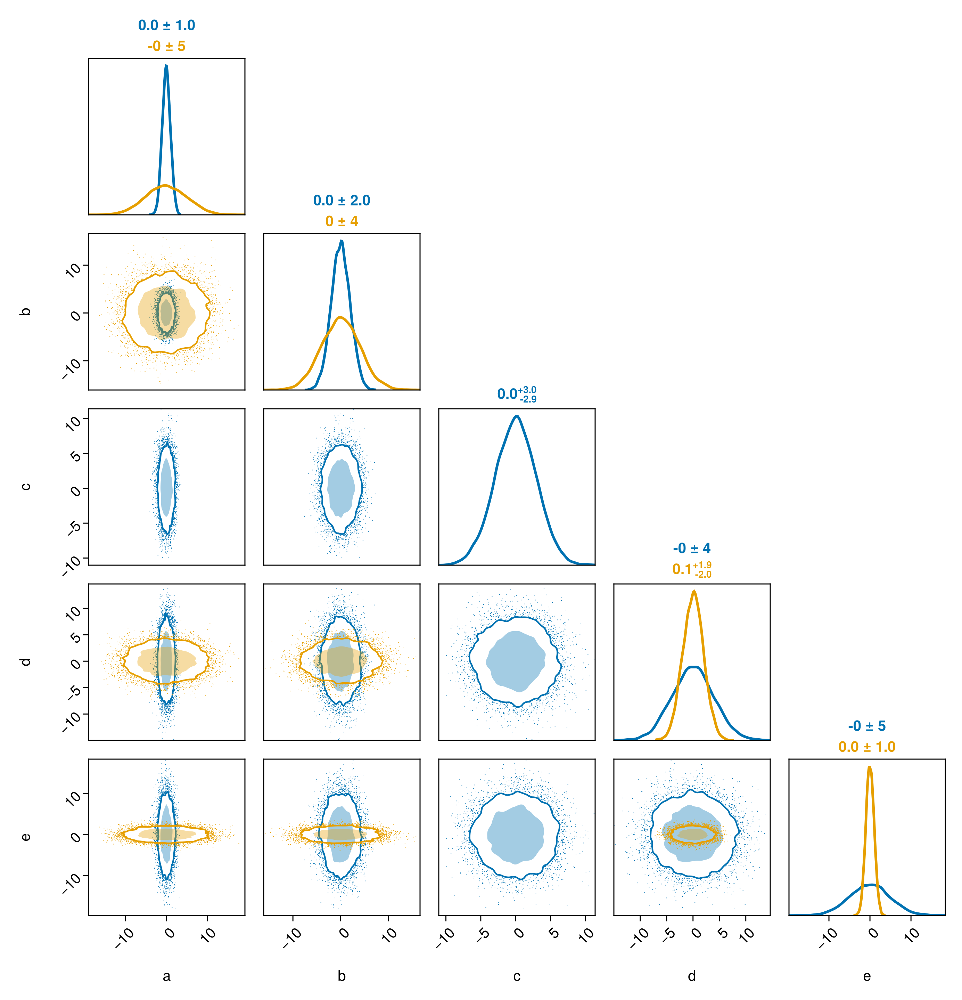

# Integration with MCMCChains.jl {#Integration-with-MCMCChains.jl}

MCMC packages like Turing often produce results in the form of an MCMCChains.Chain. There is special support in PairPlots.jl for plotting these chains.

::: tip Note

The integration between PairPlots and MCMCChains only works on Julia 1.9 and above. On previous versions, you can work around this by running `pairplot(DataFrame(chn))`.

:::

## Plotting chains {#Plotting-chains}

For this example, we&#39;ll use the following code to generate a `Chain`. In a real code, you would likely receive a chain as a result of sampling from a model.

```julia
chn1 = Chains(randn(10000, 5, 3) .* [1 2 3 4 5] .* [1;;;2;;;3], [:a, :b, :c, :d, :e])
```


```ansi
Chains MCMC chain (10000×5×3 Array{Float64, 3}):

Iterations        = 1:1:10000
Number of chains  = 3
Samples per chain = 10000
parameters        = a, b, c, d, e

Use `describe(chains)` for summary statistics and quantiles.

```


You can plot the results from all chains in the Chains object:

```julia
using CairoMakie, PairPlots

pairplot(chn1)
```

{width=923px height=942px}

The labels are taken from the column names of the chains. You can modify them by passing in a dictionary mapping column names to strings, LaTeX strings, or Makie rich text objects.

## Plotting individual chains separately {#Plotting-individual-chains-separately}

If you have multiple parallel chains and want to plot them in different colors, you can pass each one to `pairplot`:

```julia
pairplot(chn1[:,:,1], chn1[:,:,2], chn1[:,:,3])
```

{width=923px height=979px}

You can title the series indepdendently as well:

```julia
c1 = Makie.wong_colors(0.5)[1]
c2 = Makie.wong_colors(0.5)[2]
c3 = Makie.wong_colors(0.5)[3]

pairplot(
    PairPlots.Series(chn1[:,:,1], label="chain 1", color=c1, strokecolor=c1),
    PairPlots.Series(chn1[:,:,2], label="chain 2", color=c2, strokecolor=c2),
    PairPlots.Series(chn1[:,:,3], label="chain 3", color=c3, strokecolor=c3),
)
```

{width=1023px height=979px}

If your chains are well converged, then the different series should look the same.

## Comparing the results of two simulations {#Comparing-the-results-of-two-simulations}

You may want to compare the results of two simulations. Consider the following chains:

```julia
chn2 = Chains(randn(10000, 5, 1) .* [1 2 3 4 5], [:a, :b, :c, :d, :e])
chn3 = Chains(randn(10000, 4, 1) .* [5 4 2 1], [:a, :b, :d, :e]);
```


```ansi
Chains MCMC chain (10000×4×1 Array{Float64, 3}):

Iterations        = 1:1:10000
Number of chains  = 1
Samples per chain = 10000
parameters        = a, b, d, e

Use `describe(chains)` for summary statistics and quantiles.

```


Just pass them all to `pairplot`:

```julia
pairplot(chn2, chn3)
```

{width=923px height=959px}

Note how the parameters of the chains do not have to match exactly. Here, `chn2` has an additional variable not present in `chn3`.
