# Guide {#Guide}

This guide demonstrates the usage of PairPlots and shows several ways you can customize it to your liking.

Set up:

```julia
using CairoMakie
using PairPlots
using DataFrames
```


CairoMakie is great for making high quality static figures. Try GLMakie or WGLMakie for interactive plots!

We will use DataFrames here to wrap our tables and provide pleasant table listings. You can use any Tables.jl compatible source, including simple named tuples of vectors for each column.

## Single Series {#Single-Series}

Let's create a basic table of data to vizualize.

```julia
N = 100_000
α = [2randn(N÷2) .+ 6; randn(N÷2)]
β = [3randn(N÷2); 2randn(N÷2)]
γ = randn(N)
δ = β .+ 0.6randn(N)

df = DataFrame(;α, β, γ, δ)
```


We can plot this data directly using `pairplot`, and add customizations iteratively.

```julia
pairplot(df)
```

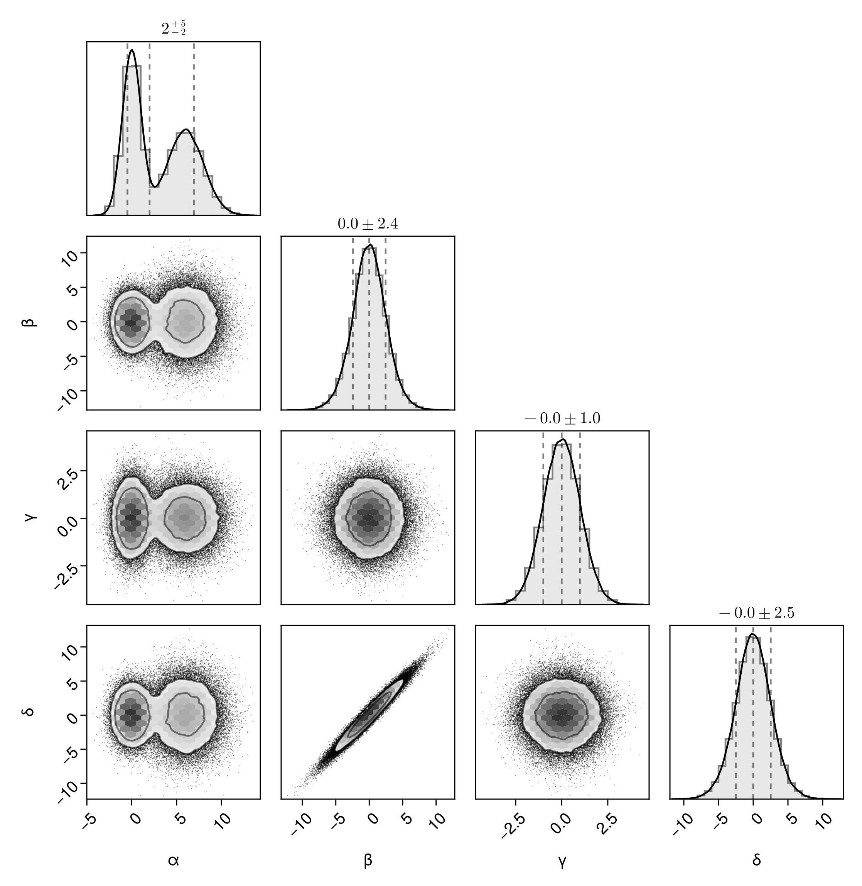

We can display a full grid of plots if we want:

```julia
pairplot(df, fullgrid=true)
```

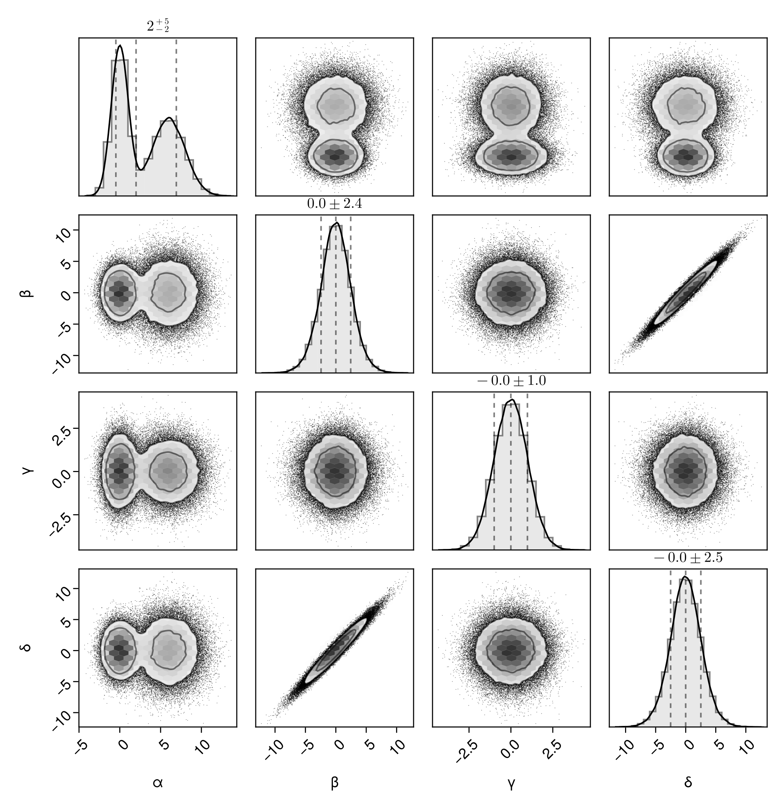

Override the axis labels:

```julia
pairplot(
    df,
    labels = Dict(
        # basic string
        :α => "parameter 1",
        # Makie rich text
        :β => rich("parameter 2", font=:bold, color=:blue),
        # LaTeX String
        :γ => L"\frac{a}{b}",
    )
)
```


Let's move onto more complex examples. The full syntax of the `pairplot` function is:

```julia
pairplot(
    PairPlots.Series(source) => (::PairPlots.VizType...),
)
```


That is, it accepts a list of pairs of `PairPlots.Series` `=>` a tuple of "vizualiation layers". As we'll see later on, you can pass keyword arguments with a series, or a specific vizualization layer to customize their behaviour and appearance. If you don't need to adjust any parameters for a whole series, you can just pass in a data source and PairPlots will wrap it for you:

```julia
pairplot(
    source => (::PairPlots.VizType...),
)
```


Let's see how this works by iteratively building up the default vizualiation. First, create a basic histogram plot:

```julia
pairplot(
    df => (PairPlots.Hist(),) # note the comma
)
```


::: tip Note

A tuple or list of vizualization types is required, even if you just want one. Make sure to include the comma in these examples.

:::

Or, a histogram with hexagonal binning:

```julia
pairplot(
    df => (PairPlots.HexBin(),)
)
```

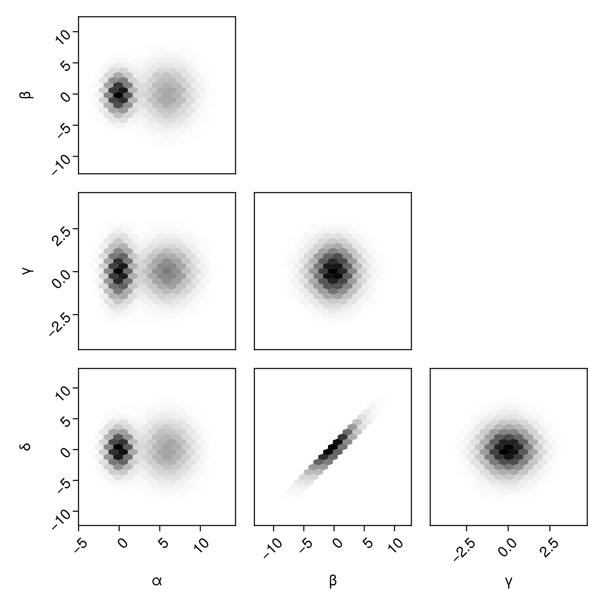

Scatter plots:

```julia
pairplot(
    df => (PairPlots.Scatter(),)
)
```


Filled contour plots:

```julia
pairplot(
    df => (PairPlots.Contourf(),)
)
```

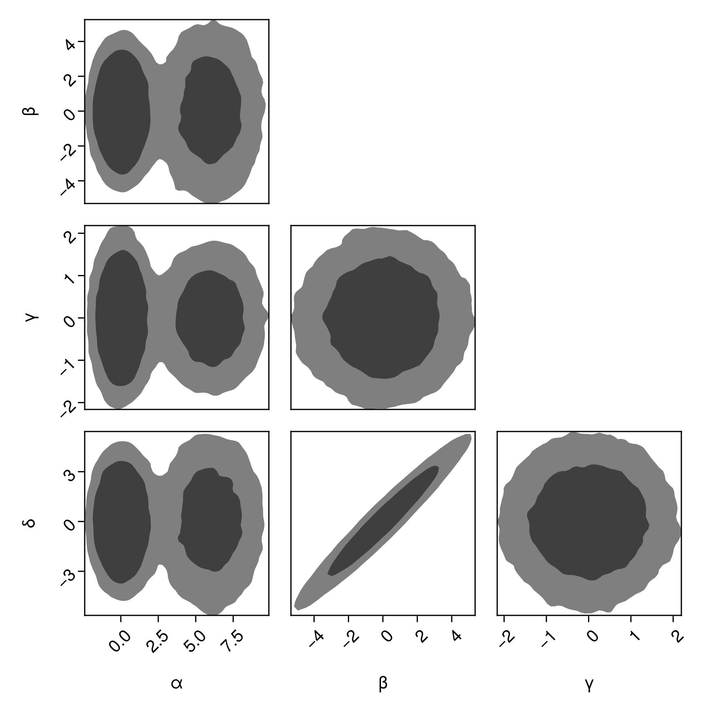

Outlined contour plots:

```julia
pairplot(
    df => (PairPlots.Contour(),)
)
```

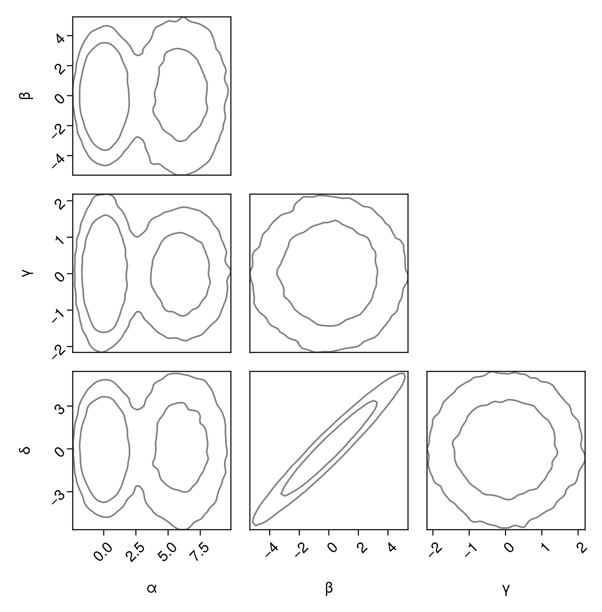

Now let's combine a few plot types.  Scatter and contours:

```julia
pairplot(
    df => (PairPlots.Scatter(), PairPlots.Contour())
)
```


Scatter and contours, but hiding points above $2\sigma$:

```julia
pairplot(
    df => (PairPlots.Scatter(filtersigma=2), PairPlots.Contour())
)
```


Placing a HexBin series underneath:

```julia
pairplot(
    df => (
        PairPlots.HexBin(colormap=Makie.cgrad([:transparent, :black])),
        PairPlots.Scatter(filtersigma=2, color=:black),
        PairPlots.Contour(color=:black)
    )
)
```

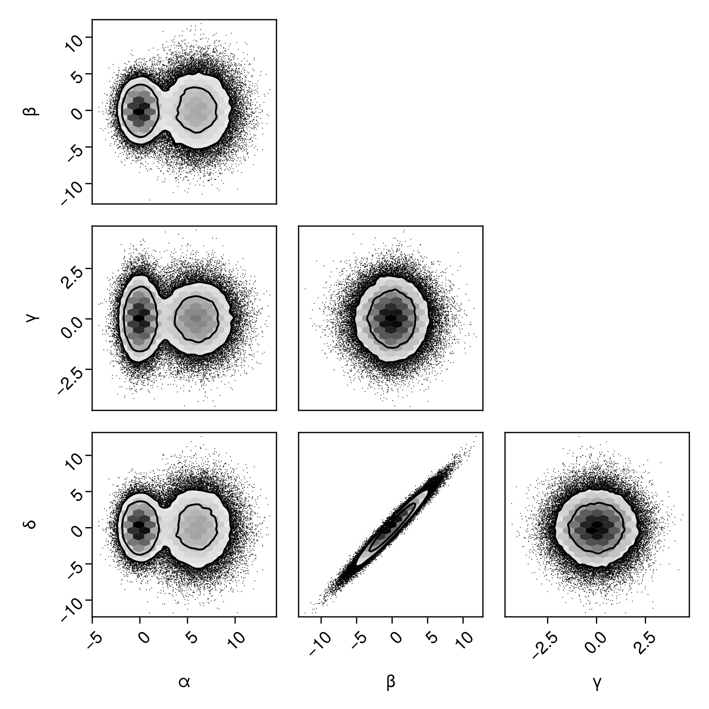

### Margin plots {#Margin-plots}

We can add additional vizualization layers to the diagonals of the plots using the same syntax.

```julia
pairplot(
    df => (
        PairPlots.HexBin(colormap=Makie.cgrad([:transparent, :black])),
        PairPlots.Scatter(filtersigma=2, color=:black),
        PairPlots.Contour(color=:black),

        # New:
        PairPlots.MarginDensity()
    )
)
```

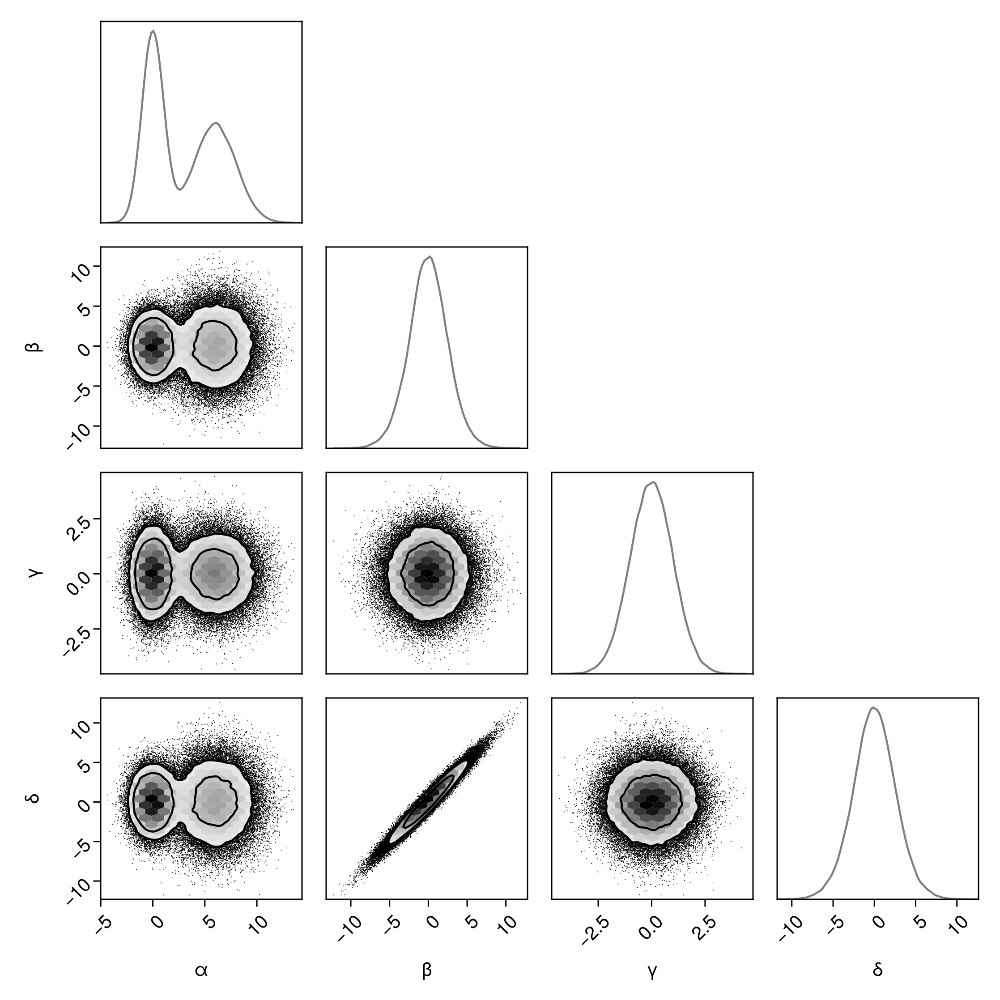

Adjust margin density KDE bandwidth (note: this multiplies the default bandwidth. A value larger than 1 increases smoothing, less than 1 decreases smoothing).

```julia
pairplot(
    df => (
        PairPlots.HexBin(colormap=Makie.cgrad([:transparent, :black])),
        PairPlots.Scatter(filtersigma=2, color=:black),
        PairPlots.Contour(color=:black),

        PairPlots.MarginDensity(bandwidth=0.5)
    )
)
```


Adding a histgoram instead of a smoothed kernel density estimate:

```julia
pairplot(
    df => (
        PairPlots.HexBin(colormap=Makie.cgrad([:transparent, :black])),
        PairPlots.Scatter(filtersigma=2, color=:black),
        PairPlots.Contour(color=:black),

        # New:
        PairPlots.MarginHist(),
        PairPlots.MarginConfidenceLimits(),
    )
)
```

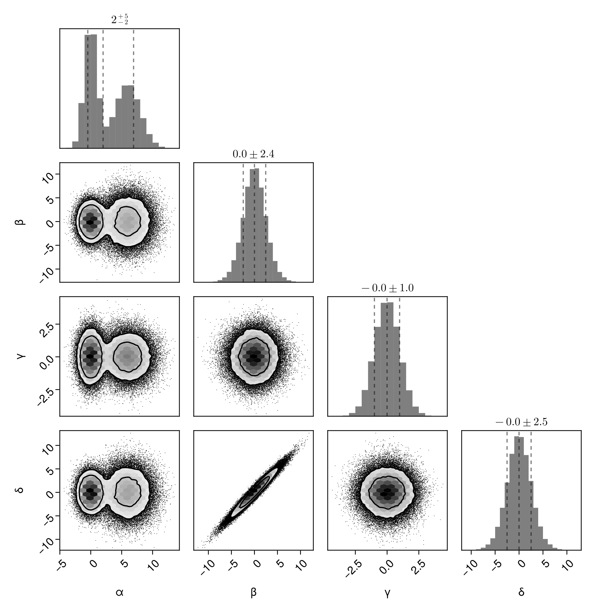

## Truth Lines {#Truth-Lines}

You can quickly add lines to mark particular values of each variable on all subplots using `Truth`:

```julia
pairplot(
    df,
    PairPlots.Truth(
        (;
            α = [0, 6],
            β = 0,
            γ = 0,
            δ = [-1, 0, +1],
        ),
        label="Mean Values"
    )
)
```


## Trend Lines {#Trend-Lines}

You can quickly add a linear trend line to each pair of variables by passing  a trend-line series:

```julia
pairplot(
    df => (
        PairPlots.Scatter(),
        PairPlots.MarginHist(),
        PairPlots.TrendLine(color=:red), # default is red
    ),
    fullgrid=true
)
```

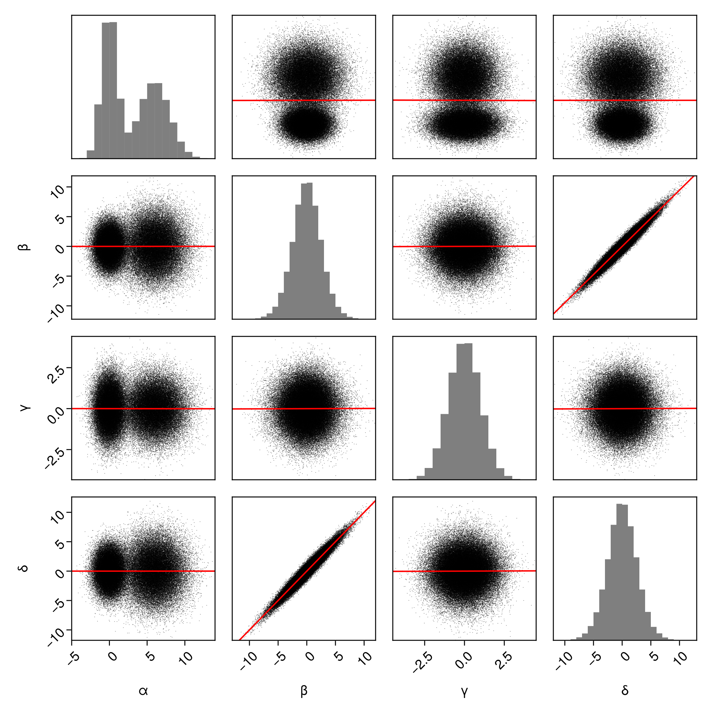

## Correlation {#Correlation}

You can add a calculated correlation value between every pair of variables by passing `PairPlots.Correlation()`. You can customize the number of digits and the position of the text.

```julia
pairplot(
    df => (
        PairPlots.Scatter(),
        PairPlots.MarginHist(),
        PairPlots.TrendLine(), # default is red
        PairPlots.Correlation()
    ),
)
```

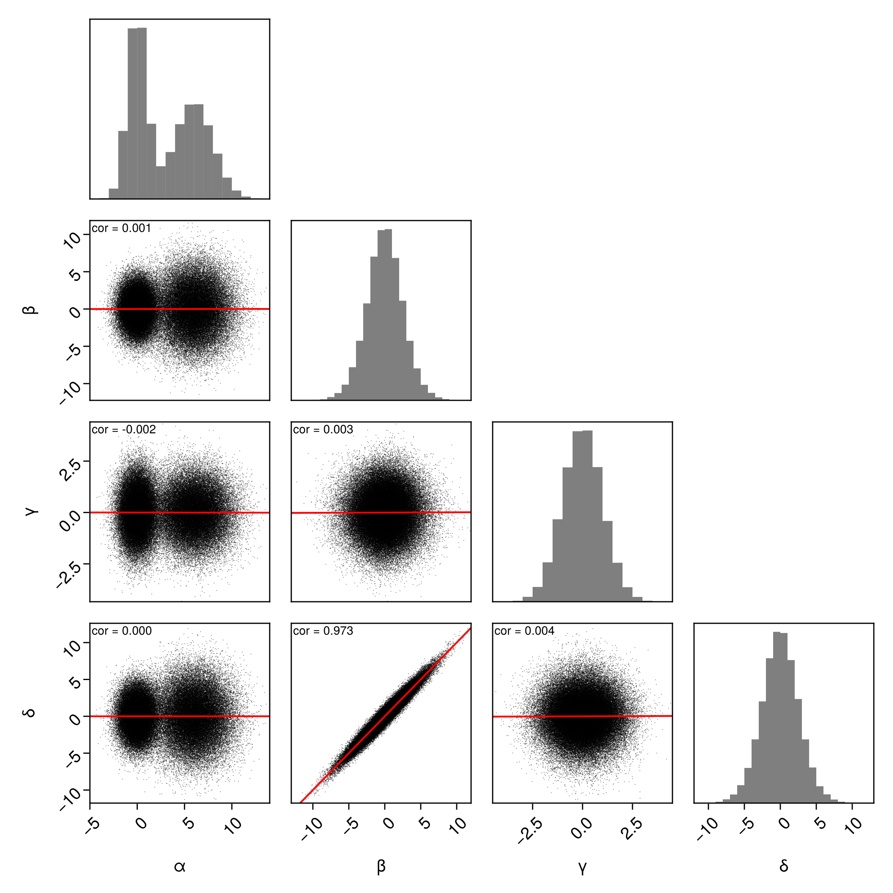

`PairPlots.Correlation()` is an alias for `PairPlots.Calculation(StatsBase.cov)`. Feel free to pass any function that accepts two AbstractVectors and calculates a number:

```julia
using StatsBase
pairplot(
    df => (
        PairPlots.Scatter(),
        PairPlots.MarginHist(),
        PairPlots.TrendLine(),
        PairPlots.Calculation(
            corkendall,
            color=:blue,
            position=Makie.Point2f(0.2, 0.1)
        )
    ),
)
```


## Customize Axes {#Customize-Axes}

You can customize the axes of the subplots freely in two ways. For these examples, we'll create a variable that is log-normally distributed.

```julia
dfln = DataFrame(;α, β, γ=10 .^ γ, δ)
```


First, you can pass axis parameters for all plots along the diagonal using the `diagaxis` keyword or all plots below the diagonal using the `bodyaxis` parameter.

Turn on grid lines for the body axes:

```julia
pairplot(dfln, bodyaxis=(;xgridvisible=true, ygridvisible=true))
```

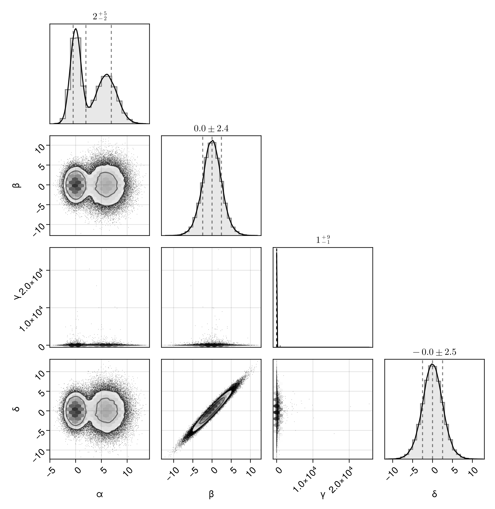

Apply a pseduo-log scale on the margin plots along the diagonal:

```julia
pairplot(dfln, diagaxis=(;yscale=Makie.pseudolog10, ygridvisible=true))
```


The second way you can control the axes is by table column. This allows you to customize how an individual variable is presented across the pair plot.

For example, we can apply a log scale to all axes that the `γ` variable is plotted against:

```julia
pairplot(
    dfln => (PairPlots.Scatter(), PairPlots.MarginStepHist()),
    axis=(;
        γ=(;
            scale=log10
        )
    )
)
```


::: tip Note

We do not prefix the attribute with `x` or `y`. PairPlots.jl will add the correct prefix as needed.

:::

::: warning Warning

Log scale variables usually work best with Scatter series. Histogram and contour based series sometimes extend past zero, breaking the scale.

:::

There is also special support for setting the axis limits of each variable:

```julia
pairplot(
    dfln => (PairPlots.Scatter(), PairPlots.MarginStepHist()),
    axis=(;
        α=(;
            lims=(;low=-10, high=+10)
        ),
        γ=(;
            scale=log10
        )
    )
)
```

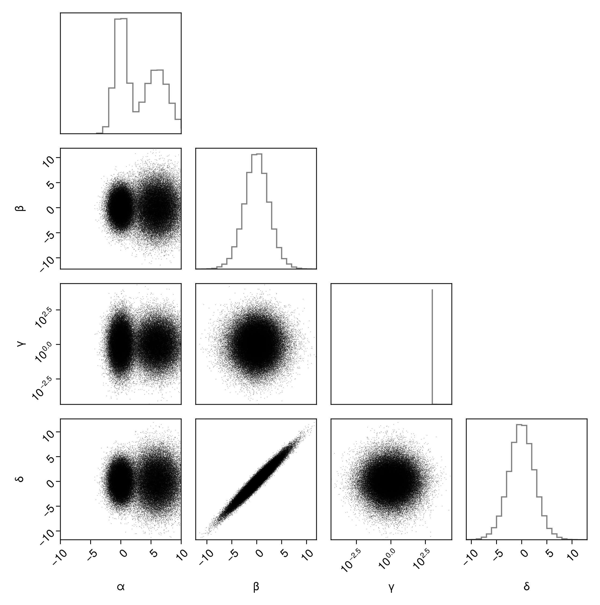

This applies the correct limits either to the vertical axis or horizontal axis as appropriate. Note that the parameters `low` and/or `high` must be passed as a named tuple.

## Adding a title {#Adding-a-title}

```julia
fig = pairplot(df)
Label(fig[0,:], "This is the title!")
fig
```


## Layouts {#Layouts}

The `pairplot` function integrates easily within larger Makie Figures.

Customizing the figure:

```julia
fig = Figure(size=(400,400))
pairplot(fig[1,1], df => (PairPlots.Contourf(),))
fig
```


::: tip Note

If you only need to pass arguments to `Figure`, for convenience you can use `pairplot(df, figure=(;...))`.

:::

You can plot into one part of a larger figure:

```julia
fig = Figure(size=(800,800))

scatterlines(fig[1,1], randn(40))

pairplot(fig[1,2], df)

lines(fig[2,:], randn(200))


colsize!(fig.layout, 2, 450)
rowsize!(fig.layout, 1, 450)

fig
```


Adjust the spacing between axes inside a pair plot:

```julia
fig = Figure(size=(600,600))

# Pair Plots must go into a Makie GridLayout. If you pass a GridPosition instead,
# PairPlots will create one for you.
# We can then adjust the spacing within that GridLayout.

gs = GridLayout(fig[1,1])
pairplot(gs, df)

rowgap!(gs, 0)
colgap!(gs, 0)

fig
```


## Multiple Series {#Multiple-Series}

You can plot multiple series by simply passing more than one table to `pairplot` They don't have to have all the same column names.

```julia
# The simplest table format is just a named tuple of vectors.
# You can also pass a DataFrame, or any other Tables.jl compatible object.
table1 = (;
    x = randn(10000),
    y = randn(10000),
)

table2 = (;
    x = 1 .+ randn(10000),
    y = 2 .+ randn(10000),
    z = randn(10000),
)

pairplot(table1, table2)
```

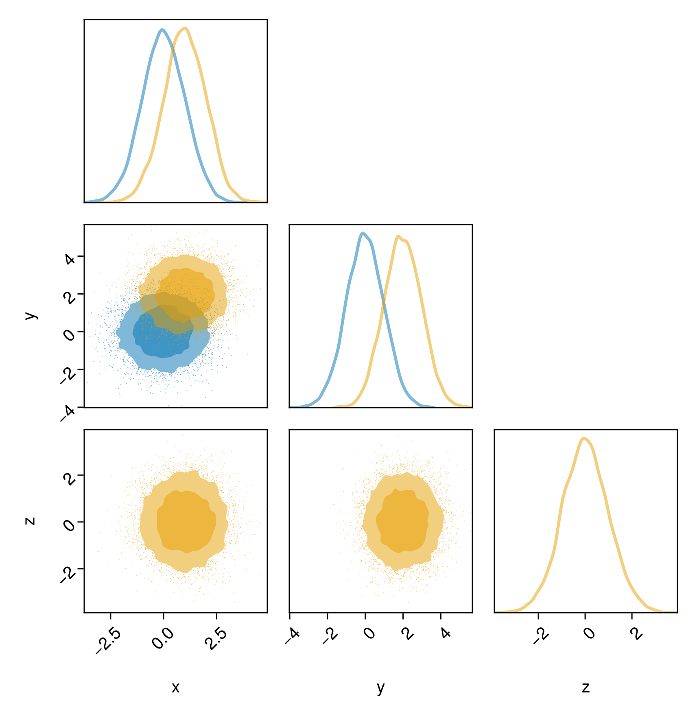

You may want to add a legend:

```julia
c1 = Makie.wong_colors(0.5)[1]
c2 = Makie.wong_colors(0.5)[2]

pairplot(
    PairPlots.Series(table1, label="table 1", color=c1, strokecolor=c1),
    PairPlots.Series(table2, label="table 2", color=c2, strokecolor=c2),
)
```


You can customize each series independently if you wish.

```julia
pairplot(
    table2 => (PairPlots.HexBin(colormap=:magma), PairPlots.MarginDensity(color=:orange),  PairPlots.MarginConfidenceLimits(color=:black)),
    table1 => (PairPlots.Contour(color=:cyan, strokewidth=5),),
)
```


